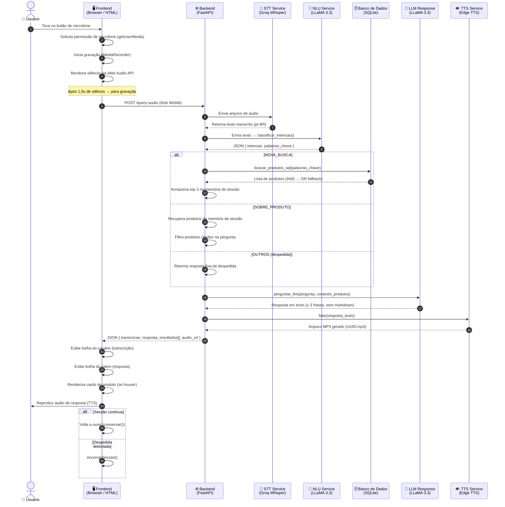
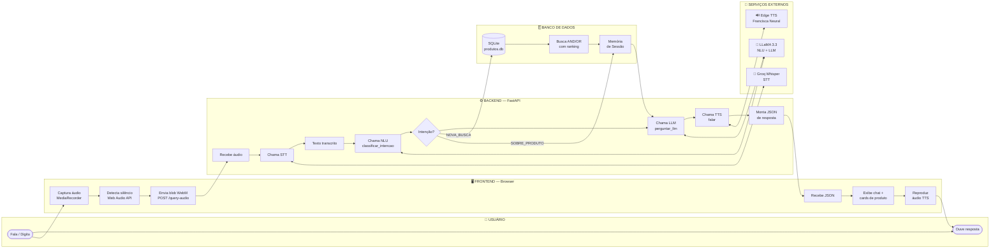
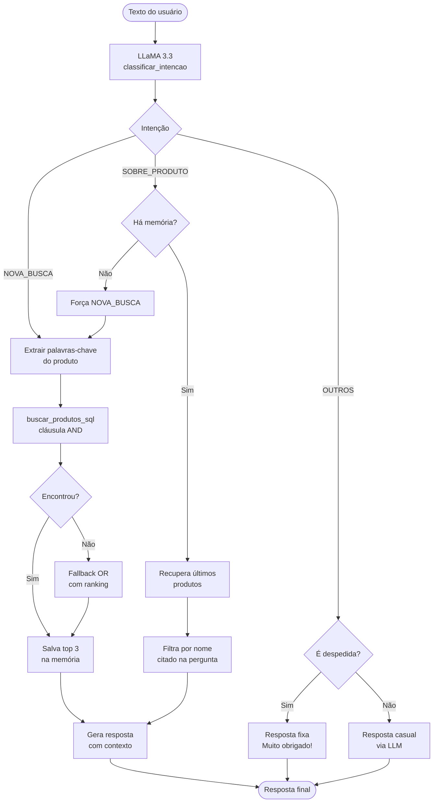
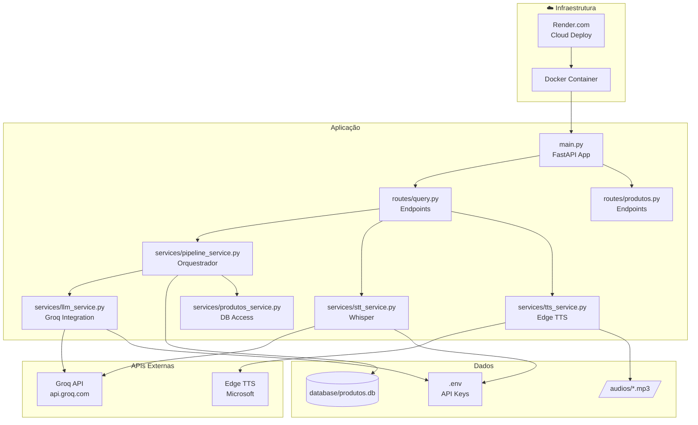

# Diagrama de Operação — Totem de Autoatendimento Acessível
**Formato:** Swimlane Horizontal · v1.0 · Abril/2026

---

## Fluxo Completo de uma Interação por Voz

---

## Diagrama Swimlane Horizontal (Estilo Processo)

---

## Fluxo de Classificação de Intenção (Detalhe)

---

## Diagrama de Componentes e Dependências

---

*Diagramas gerados com Mermaid.js — renderizáveis no GitHub, Notion e VS Code (extensão Mermaid Preview)*
