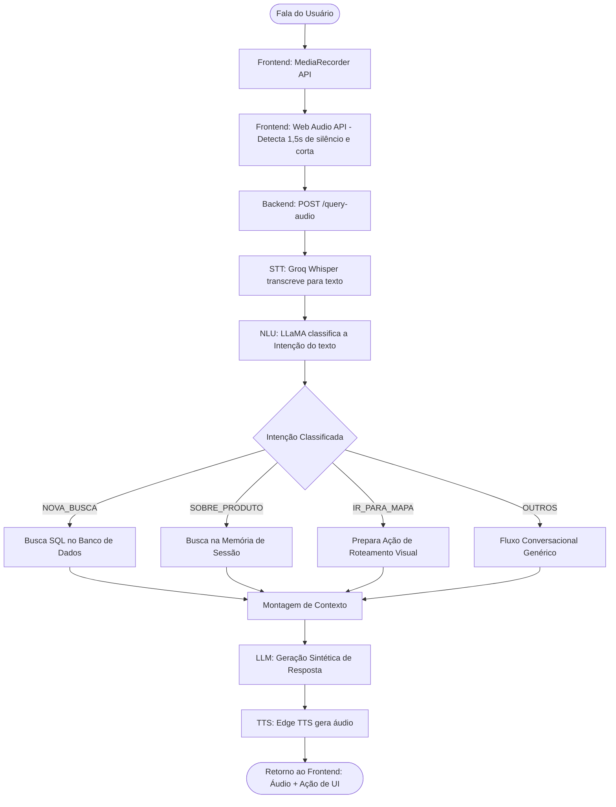

# PRD — Totem de Autoatendimento Acessível
## Product Requirements Document · v3.1
**Projeto:** TCC — Engenharia da Computação · UNISANTA  
**Equipe:** Davi Xavier de Lima · Kauã Santos Silva · Rafael Luiz Forssell Ferrara Fomin  
**Orientador:** Sergio Schina de Andrade  
**Revisão:** Maio / 2026

---

## 1. Visão do Produto

O **Totem de Autoatendimento Acessível** é um sistema embarcado de consulta interativa para lojas físicas de varejo, com foco principal em **acessibilidade para pessoas com deficiência visual e mobilidade reduzida**. O sistema permite que qualquer usuário encontre produtos, consulte preços e visualize localizações no mapa da loja através de linguagem natural falada.

> **Missão:** Tornar a experiência de compra em lojas físicas completamente autônoma e acessível para todos os perfis de usuário, combinando interação por voz natural e orientações visuais.

---

## 2. Problema

Lojas físicas de varejo enfrentam dois desafios simultâneos:

1. **Exclusão de pessoas com deficiência visual** — totens tradicionais dependem exclusivamente de interação visual e telas de toque complexas, tornando-se inacessíveis.
2. **Sobrecarga de atendentes** — perguntas repetitivas sobre localização de produtos consomem tempo de profissionais que poderiam focar em vendas consultivas.

Não existe, no mercado nacional de médio porte, uma solução integrada e acessível que resolva ambos os problemas simultaneamente com baixo custo de implementação e uso intuitivo de Inteligência Artificial.

---

## 3. Usuários-Alvo

| Perfil | Características | Necessidade Principal |
|---|---|---|
| **Comprador com DV** | Deficiência visual parcial ou total | Consulta orientada por voz, feedback sonoro descritivo |
| **Comprador comum** | Sem deficiência, pressa ou timidez | Autoatendimento rápido sem necessidade de filas |
| **Idoso / Baixa literacia** | Dificuldade com interfaces digitais complexas | Interação via linguagem natural simples |
| **Operador da loja** | Gerente ou atendente | Atualização rápida do banco de produtos |

---

## 4. Objetivos e Métricas de Sucesso

### Objetivos Acadêmicos (TCC)
- Demonstrar viabilidade técnica de IA conversacional orquestrada em tempo real (STT -> NLU -> LLM -> TTS).
- Validar a arquitetura dividida entre classificação analítica de intenção e geração sintética de texto.
- Implementar e documentar recursos de acessibilidade nativa na web (Web Audio API).

### Métricas de Sucesso do Sistema
| Métrica | Meta |
|---|---|
| Tempo médio de resposta (voz → áudio de volta) | ≤ 4 segundos |
| Taxa de reconhecimento correto de intenção | ≥ 85% |
| Taxa de acerto na busca de produto no banco | ≥ 80% das consultas |
| Uptime do backend | ≥ 95% |

---

## 5. Arquitetura Técnica Atual

### Stack Tecnológico

| Camada | Tecnologia | Função |
|---|---|---|
| **Frontend** | HTML5 + JS Vanilla + Tailwind CSS | Single Page Application (SPA) responsiva |
| **Backend API** | Python 3 + FastAPI + Uvicorn | Servidor assíncrono REST |
| **STT** | Groq API (Whisper Large v3 Turbo) | Transcrição de áudio para texto |
| **NLU / Classificação** | Groq API (LLaMA 3.3 70B) | Classificação analítica de intenção (JSON) |
| **LLM Resposta** | Groq API (LLaMA 3.3 70B) | Geração de resposta contextualizada |
| **TTS** | Microsoft Edge TTS (pt-BR-FranciscaNeural) | Síntese de voz em formato MP3 |
| **Banco de Dados** | SQLite3 | Catálogo relacional de produtos |
| **Hospedagem** | Render (cloud free tier) | Hospedagem contínua do backend via Docker |

### Estrutura do Frontend (SPA)

A interface de usuário consiste em uma única página (`index.html`) modularizada em 5 blocos visuais distintos, com transições gerenciadas via JavaScript:
1. **Home:** Tela inicial de repouso ("Start").
2. **Chat:** Interface de comunicação principal com o agente virtual e listagem compacta de produtos.
3. **Produto:** Visão detalhada de um item selecionado.
4. **Mapa:** Renderização em SVG vetorial da planta da loja, com destaque luminoso da rota e corredor do produto alvo.
5. **Idiomas:** Seleção dinâmica de linguagem (Português/Inglês) atualizando variáveis de contexto.

---

## 6. Pipeline de Processamento (Fluxo Principal)

A arquitetura orienta o processamento da entrada do usuário através de um pipeline linear, que garante a precisão separando o entendimento analítico da geração sintética:

---

## 7. Estratégia de Engajamento e Navegação

Para valorizar a interface gráfica e o sistema de mapa integrado, o prompt de resposta do LLM possui uma diretriz comportamental de interação. Ao informar as características de um produto encontrado, a inteligência artificial é instruída a **omitir temporariamente a informação descritiva da localização exata** (prateleira e corredor) em sua resposta verbal. Em vez disso, o sistema encerra a frase sugerindo ou questionando se o usuário deseja visualizar o caminho físico do item, incentivando a navegação para a tela de **Mapa Visual** e induzindo o reconhecimento da intenção `IR_PARA_MAPA` na fala subsequente.

---

## 8. Funcionalidades Implementadas (v1.0 – MVP Real)

A versão atual da aplicação já superou a expectativa inicial, integrando elementos de versões posteriores:

| ID | Funcionalidade | Status |
|---|---|---|
| F-01 | Interface SPA com 5 telas dinâmicas (Home, Chat, Produto, Mapa, Idiomas) | ✅ Implementado |
| F-02 | Captura de voz nativa via MediaRecorder API | ✅ Implementado |
| F-03 | Detecção automática de silêncio via Web Audio API | ✅ Implementado |
| F-04 | Transcrição de áudio via Groq Whisper | ✅ Implementado |
| F-05 | NLU para Intenções (NOVA_BUSCA, SOBRE_PRODUTO, IR_PARA_MAPA, OUTROS) | ✅ Implementado |
| F-06 | Motor de busca AND/OR com ranqueamento de relevância (SQLite) | ✅ Implementado |
| F-07 | Memória de sessão efêmera e filtro inteligente de produtos | ✅ Implementado |
| F-08 | Resposta LLM contextualizada com incentivo à navegação visual do mapa | ✅ Implementado |
| F-09 | Mapa visual (SVG) interativo com iluminação dinâmica da rota | ✅ Implementado |
| F-10 | Suporte nativo a múltiplos idiomas (Português/Inglês) via dicionário embutido | ✅ Implementado |
| F-11 | Síntese de voz em tempo real (Edge TTS - pt-BR ou en-US) | ✅ Implementado |
| F-12 | Mensuração interna de tempos de latência (STT, IA, TTS) no backend | ✅ Implementado |

---

## 9. Funcionalidades Planejadas (Próximas Iterações)

As funcionalidades restantes são focadas em polimento e ferramentas de apoio para administração do negócio e validação acadêmica:

| ID | Funcionalidade | Prioridade |
|---|---|---|
| F-13 | Consumo completo da entrada por texto (via botão no chat) | ALTA |
| F-14 | Alternância gráfica de alto contraste (Acessibilidade WCAG AA) | ALTA |
| F-15 | Painel Administrativo de Produtos (CRUD visual para o lojista) | MÉDIA |
| F-16 | Aplicação formal da avaliação de usabilidade (SUS / Likert) | MÉDIA |

---

## 10. Requisitos Não-Funcionais e Limitações

### Acessibilidade
- O sistema detecta ativamente a interrupção da fala, desobrigando que o usuário segure o botão enquanto fala (ideal para indivíduos com baixa coordenação motora ou deficiência visual).
- Transições de tela possuem feedback de áudio em tempo real.

### Performance e Telemetria
- O backend monitora ativamente as latências. O log registra separadamente os tempos de STT, NLU e TTS para futura análise estatística de desempenho do protótipo em produção na nuvem.
- Cold Starts do Render (free tier) exigem manutenção de conectividade em períodos de testes rigorosos.

### Limitações Conhecidas
- A dependência de APIs externas gratuitas (Groq e Edge TTS) pode sofrer limitações de taxa de transferência (*Rate Limits*) em cenários de alta concorrência.
- A eficiência da transcrição (STT) decai em ambientes com altíssimo índice de ruído branco, demandando ajuste no limiar de amplitude (*threshold*) configurado na Web Audio API.

---

*Documento atualizado automaticamente para refletir o estado do repositório em Maio de 2026.*  
*Versão anterior: PRD-3.0 | Próxima revisão: Fim do Ciclo de Desenvolvimento.*
